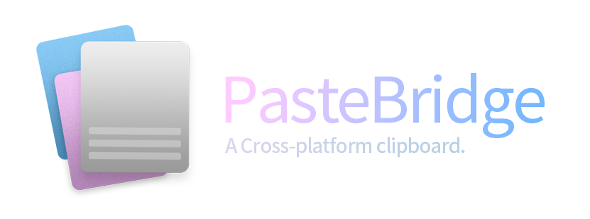

<em>
📋 A cross-platform clipboard, Powered by PHP. 📋
</em>

***

English | [中文](./README-CN.md)

## Features

- [x] Cross-platform clipboard to save your time⏰
  - [x] Web-interface (built-in)
  - [ ] Android App
  - [ ] iOS App
  - [ ] Windows App
- [x] Native Copy&Paste function support📋
- [x] Encrypted Transmitting🔒
- [x] An offcial online service🌐

## Offcial Service
[https://pastebridge.com](https://pastebridge.com)

## Installation
Requirements:
- PHP 7+
- Database SoftWare (AnyOne)
  - MySQL 5.5.3 or higher
  - SQLite 3.7.11 or higher
  - PostgreSQL 9.1 or higher

## Documents
[https://docs.pastebridge.com](https://docs.pastebridge.com)

## Contributing

## Licensing

Based On GPT-3.0 LISENCE

